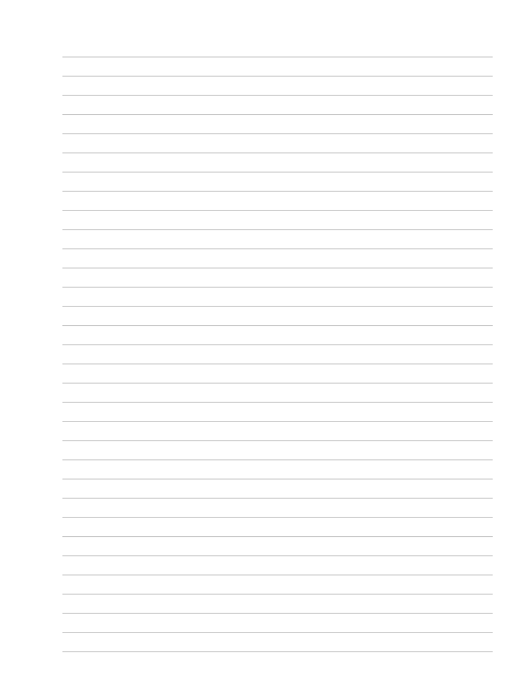
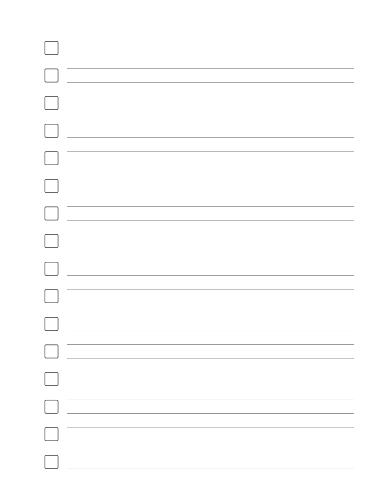
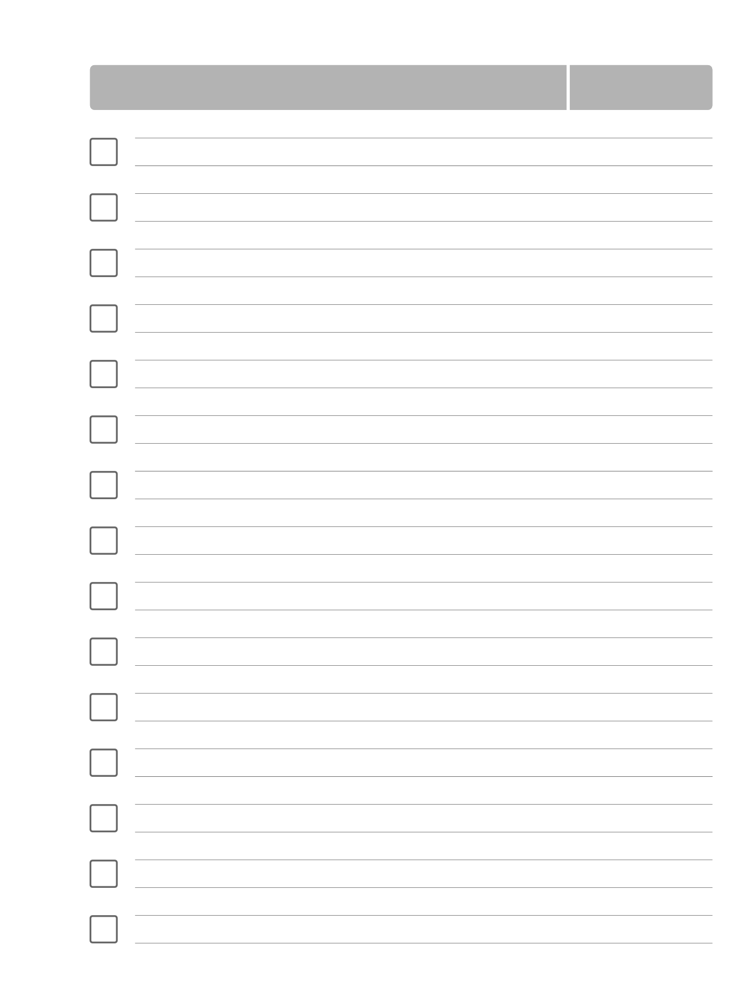

# Templates
Templates for the reMarkable tablet (https://remarkable.com).

Just a few templates for the reMarkable tablet. I like their small lines template a lot, so created some new template with the same line height.

**E_Lines.png:**

Just some lines with borders. 

**E_Lines_ToDo.png:**

ToDo List with the same line-heigh.

**E_Lines_Projekt.png:**

ToDo List with header.

**E_Lines_Projekt_Text.png:**

ToDo List with header und space for notes.

## Installation:
Copy files to your reMarkable tablet (instructions: https://remarkablewiki.com/tips/templates)
You can add this section to the templates.json:

''{
      "name": "ToDo Lines",
      "filename": "E_Lines_ToDo",
      "iconCode": "\ue98f",
      "categories": [
        "Custom"
      ]
    },
	{
      "name": "Project (Lines)",
      "filename": "E_Lines_Projekt",
      "iconCode": "\ue98f",
      "categories": [
        "Custom"
      ]
    },
    {
      "name": "Project (Lines/Text)",
      "filename": "E_Lines_Projekt_Text",
      "iconCode": "\ue98f",
      "categories": [
        "Custom"
      ]
    },
    {
      "name": "Lines (small)",
      "filename": "E_Lines",
      "iconCode": "\ue9a8",
      "categories": [
        "Custom"
      ]
 }
 ''
